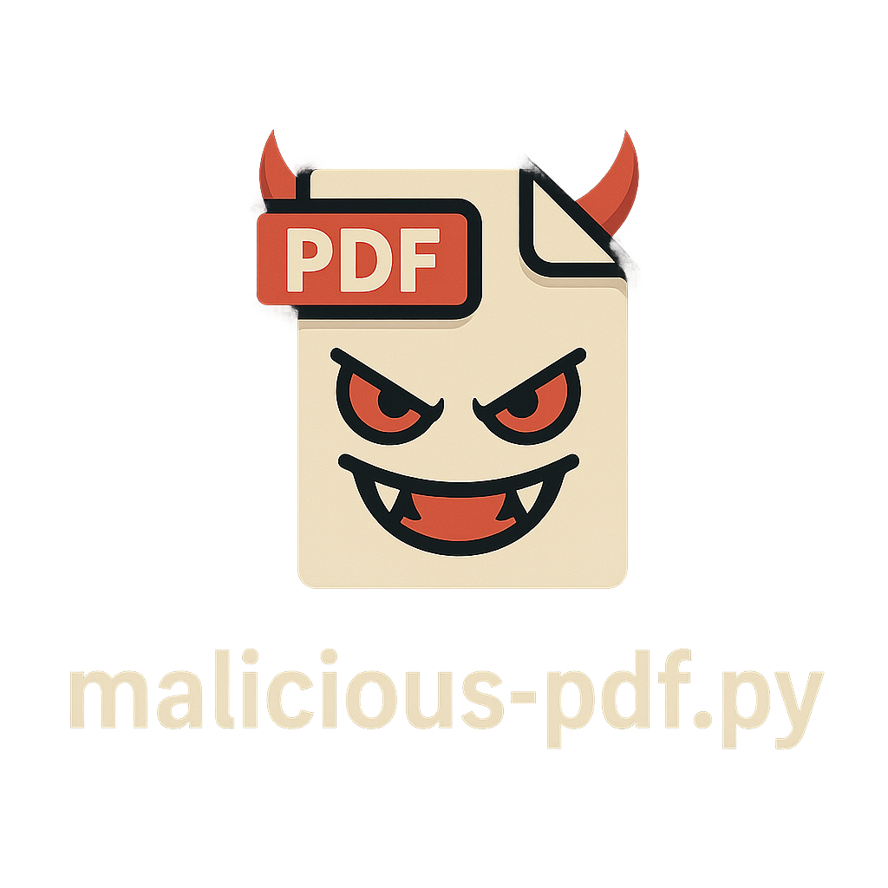

<p align="center">
  
</p>

<h1 align="center">Malicious PDF Generator</h1>

<p align="center">
  <strong>By BenzoXdev</strong><br>
  A powerful and versatile tool for generating custom malicious PDFs for testing and research.
</p>

<p align="center">
  <a href="#license"></a>
  <a href="#prerequisites"></a>
</p>

---

## Table of Contents
1. [Key Features](#key-features)
2. [Use Cases](#use-cases)
3. [Prerequisites](#prerequisites)
4. [Installation](#installation)
5. [Usage](#usage)
6. [Examples](#examples)
7. [Advanced Techniques](#advanced-techniques)
8. [Security & Best Practices](#security--best-practices)
9. [Contributing](#contributing)
10. [License](#license)
11. [Contact & Support](#contact--support)

---

## Key Features
- ✅ **Multi-vector Payloads**: JavaScript, XFA forms, GoTo/Launch actions, EICAR, and more.
- ⚙️ **Customizable Host**: Use any IP, domain, or Burp Collaborator instance.
- ⚡ **Rapid PDF Generation**: One command to create multiple test files.
- 🧩 **Modular Design**: Easily add or modify payload templates.
- 🧠 **Documentation & Examples**: Clear, concise usage instructions.

---

## Use Cases
- **Antivirus/EDR Testing**: Evaluate endpoint detection and prevention capabilities.
- **Web App Penetration Testing**: Upload handling, sandbox escapes, and script-based payloads.
- **Red Team Operations**: Deliver realistic malicious documents during engagements.

---

## Prerequisites
- **OS**: Windows, macOS, or Linux
- **Python**: 3.8 or higher
- **Modules**:  
  - `validators`  
  - `ipaddress`  
  - `bz2`, `base64` (Python built-in)

# Install dependencies:
```bash
pip install -r exigences.txt

```
---

# Installation
```
git clone https://github.com/BenzoXdev/malicious-pdf.git
cd malicious-pdf
pip install -r exigences.txt
```

---

# Usage

Basic Command
```
python malware-pdf.py yourdomain.burpcollaborator.net
```
Generated Files Overview

File	Description

test1.pdf	GoToE action (external link)
test2.pdf	XDP-based form submission
test3.pdf	JavaScript app.openDoc call
test4.pdf	XSLT injection using XFA forms
test5.pdf	URI link action
test6.pdf	Launch action for file execution
test7.pdf	GoToR action with remote PDF reference
test8.pdf	SubmitForm action with HTML flags
test9.pdf	ImportData action (data exfiltration)
test10.pdf	macOS Calculator PoC (CVE-2017-10951)
test11.pdf	Embedded EICAR antivirus test string


---

# Examples

# Using a Burp Collaborator instance
```
python malware-pdf.py my-collab.burpcollaborator.net
```
# Using a direct IP
```
python malware-pdf.py 192.168.1.100
```

---

# Advanced Techniques

Extend Payloads: Add your own create_malpdfX() functions.

File Hashing: Integrate SHA256 or MD5 checksums.

CI/CD Integration: Use for automated security testing pipelines.

Dockerize: Run in isolated, reproducible containers.


---

# Security & Best Practices

Test Legally: Only in controlled, non-production environments.

Isolate Network: Use VPNs or segmented test labs.

Monitor Traffic: Log callbacks and requests for analysis.

Clean Up: Delete files and disable endpoints after use.


---

# Contributing

Contributions are welcome!

1. Fork this repository.


2. Create a feature branch: git checkout -b feature/my-feature.


3. Commit your changes: git commit -m "Add new payload".


4. Push to GitHub: git push origin feature/my-feature.


5. Open a Pull Request with a detailed description.


---

# License

This project is licensed under the MIT License. See the LICENSE file for more information.


---

### Contact & Support

Author: BenzoXdev

GitHub: BenzoXdev
